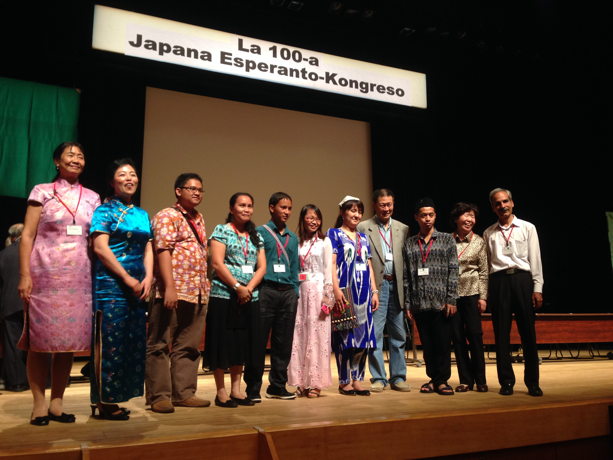
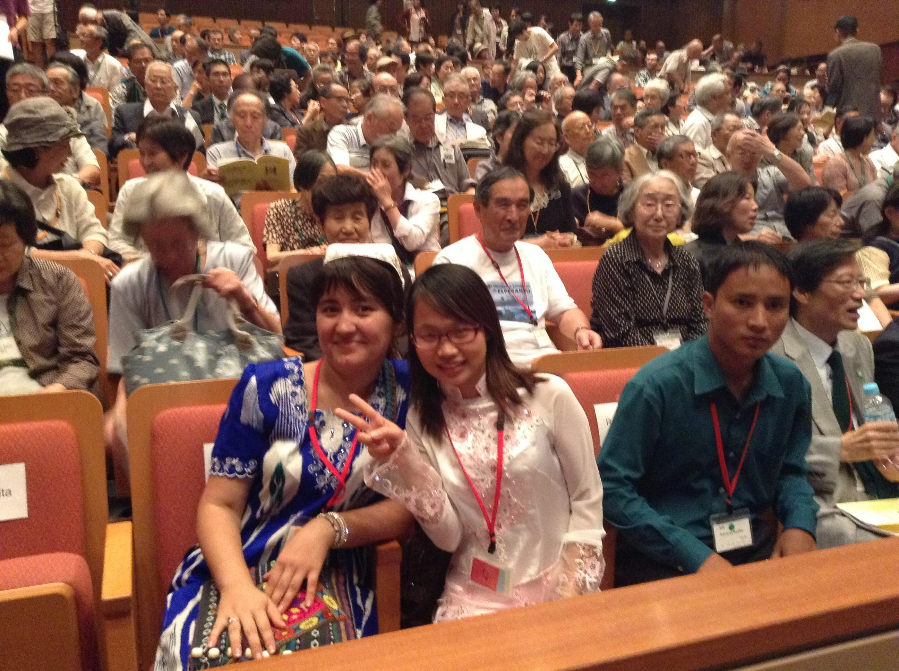
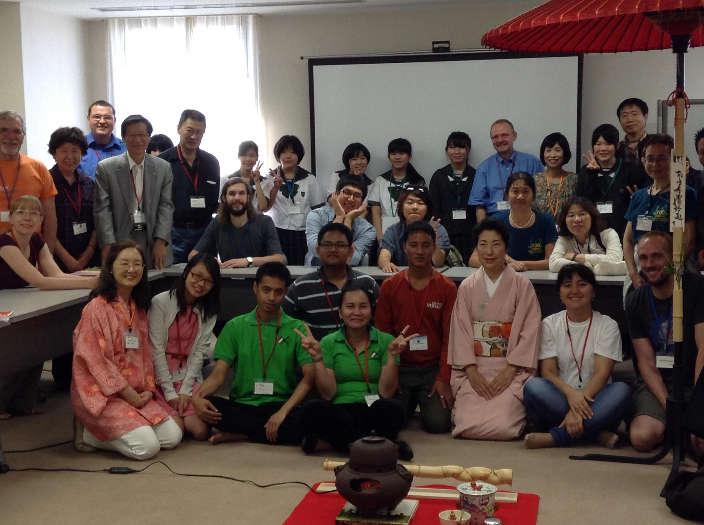
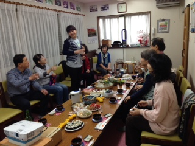
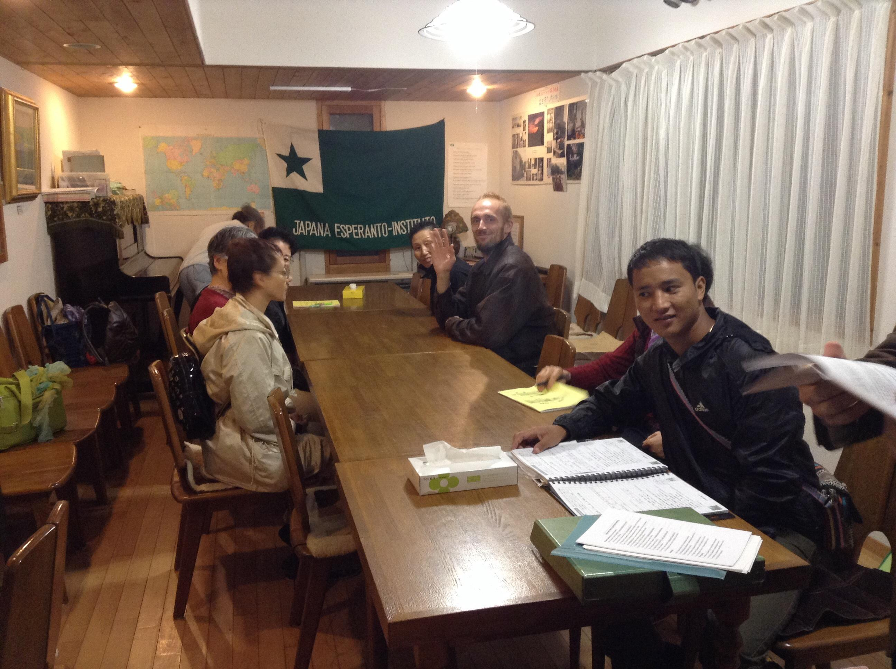

# Vojaĝo al Japanio  
kaj partopreno en la 100-a Japana Esperanto-kongreso

### *Uzakova Mehrangez*

Mi loĝas konstante en la eta mezazia montara lando Taĝikio. Mi volas
rakonti pri miaj impresoj dum la vojaĝo al Japanio kaj partopreno en la
100-a Japana Esperanto-kongreso.  
Kiam mi estis demandita pri eventuala vojaĝo al Japanio por partopreni
la kongreson, mi neniam supozis, ke tio vere okazos. Antaŭ ol vojaĝi al
Japanio, mi opiniis, ke ankaŭ tie tre malmulte da homoj parolas
Esperanton. Kaj kiam mi alvenis en Japanion kaj atendis s-inon Aihara en
la flughaveno, mi multe legis, ĉar mi ankoraŭ ne bone konis la lingvon.
En la flughaveno oni renkontis min tre bone. Post kiam ni venis al la
hotelo oni kondukis min al la konstruaĵo kie devos okazi la kongreso.
Tie ni konatigis kun la homoj, kiuj preparis la kongreson. Malgraŭ, ke
ĉiuj estis tre okupataj, ili esis bonkoraj, afablaj kaj amikemaj. En
tiu ĉi tago mi renkontis plurajn tre interesajn homojn el diversaj
landoj.  
En En la malferma tago, kiam mi iris al la kongresejo, mi ne povis
kredi, ke mi vidos tiom multe da homoj. Kiam mi venis en la kongresejon
kaj vidis multe da partoprenantoj, mi eĉ iomete timis. Ni,la gastoj,
sidis sur la podio kaj ni devis paroli salutvortojn . Por mi, tio estis
la unua kongreso kaj elpaŝo. Ĉiuj partoprenantoj parolis tiel klare, ke
mi komencis maltrankviliĝi. Kaj kiam mi komencis paroli, mi estis tre
maltrankvila. Eĉ la voĉo mia tremis.  
Por mi estis iomete malfacile. Mi provis aŭskulti atente ĉiujn sed,
bedaŭrinde, ne povis respondi ĝuste. Dum la unuaj du tagoj mi tre
ekcitiĝis, sed danke al la organizantoj de la kongreso, mi komencis
komuniki kaj evoluigi mian lingvon. La partoprenantoj ĉiam helpis al mi,
kaj kiam mi ne komprenis, ili klarigis per gestoj, ĉiam klopodante doni
konsilon. Tial mi parolis multe. Post du-tri tagoj ĉio fariĝis por mi
tre interesa.  
Kio min plej surprizis estis tio, ke malgraŭ la diversaj aĝoj, seksoj,
nacioj, kulturoj, religioj ni povis bone kompreni unuj la aliajn danke
al nia komuna helplingvo Esperanto. Ni ĉiuj estis tiom malsamaj, kaj ni
ĉiuj scivolis, de kie ni estas, kion ni faras, kion ni amas, kiujn
interesojn ni havas. Malgraŭ la okupo, ĉiuj partoprenantoj lernis la
lingvon. Mi surpriziĝis, ke en multaj landoj estas fonditaj institucioj
de tiu ĉi lingvo. Kaj ekzistas tre multe da homoj, kiuj volas lerni la
lingvon.  
Danke al la organizantoj de la kongreso, ni ĉiuj fariĝis novaj amikoj
kaj konatoj, eĉ fratoj kaj fratinoj. Tio mirigis min\! De la unua tago
ĉio estis organizita en la plej alta nivelo. Ĉiu programero estis
preparita tre bone kaj estis en si mem tre interesa.  
Mi estas tre dankema al la organizantoj de la kongreso kaj al ĉiuj
personoj, kiuj helpis al mi por partopreni la kongreson kaj dum la
rondvojaĝo. Post la kongreso, oni helpis min, do mi povis vidi la
landon, konatiĝi pri la ĉiutaga vivo de japanoj, renkonti interesajn
homojn, kaj la plej grava afero estas tio, ke mi komprenis kia lingvo
estas Esperanto, kaj kiun ŝancon ĝi donas.  
Ankoraŭfoje mi volas kore danki al ĉiuj, kiuj helpis al mi viziti tiun
ĉi miraklan landon - Esperantujon\! Certe mi kore dankas ankaŭ mian
instruiston s-on Firdaŭs Ŝukurov, kiu vekis ĉe mi intereson al tia
mirinda lingvo kaj helpis organizi la vojaĝon. Kiel oni diras en mia
depatra lingvo: "Ba hamai shumojon rahmati kalon"\! **

### [al la ĉefa paĝo](../espermov.htm)

